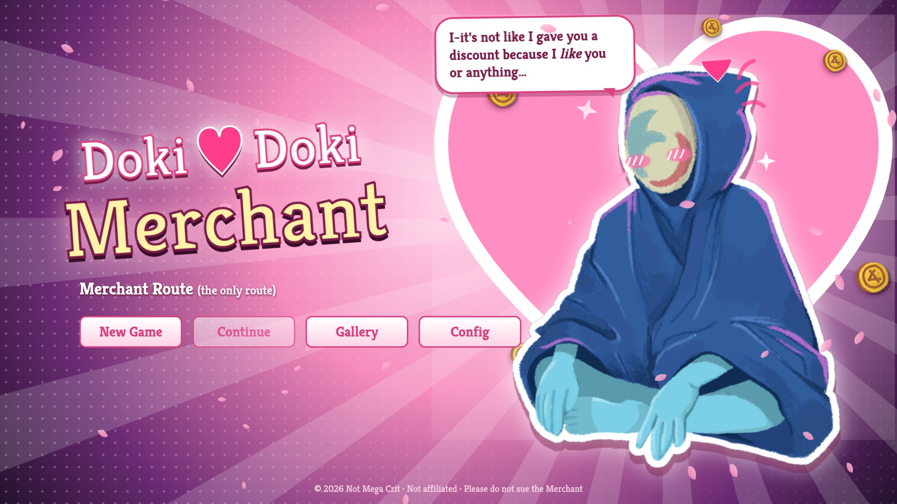
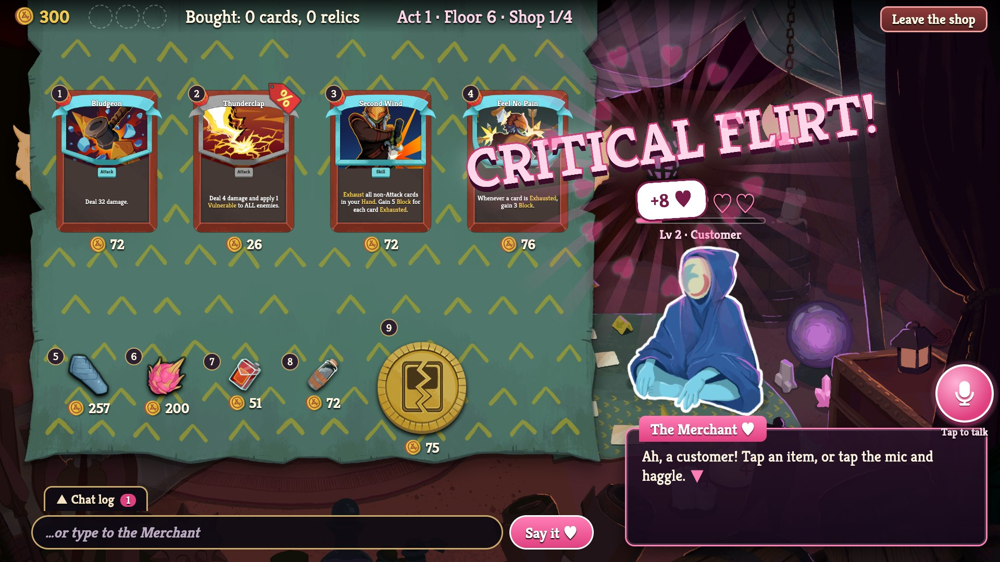
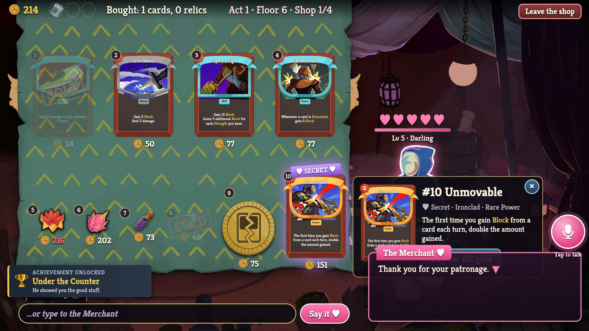
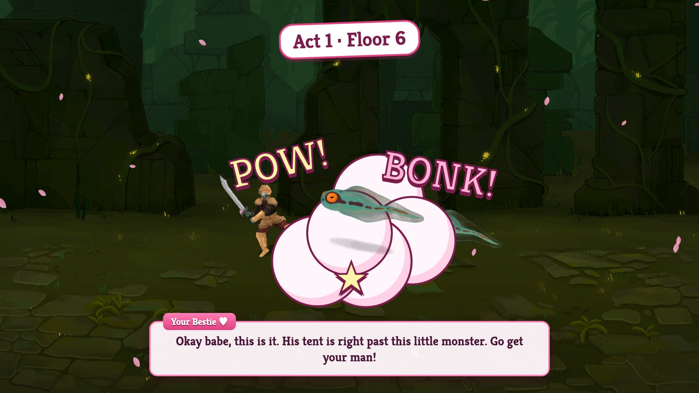
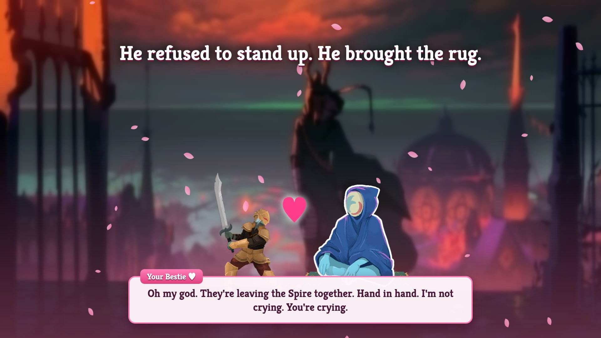
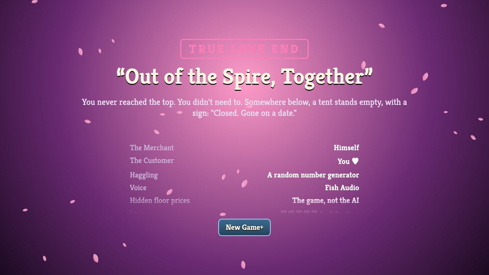
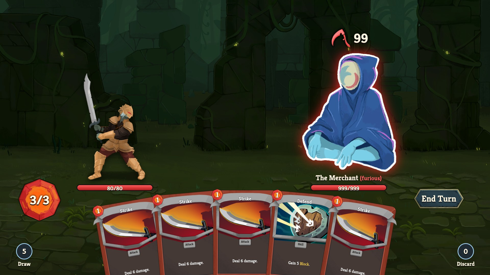

# Doki Doki Merchant ♥

*You climbed the Spire to kill the Architect. You stayed for the man on the rug.*



**Doki Doki Merchant** is a Slay the Spire 2 mod about the most emotionally unavailable man in the Spire: the
Merchant. He sells you cards. He sells you relics. He refuses, on principle, to stand up. And now he talks back.

Walk into any shop in your actual run and the shelves are gone: he's on the rug, you haggle with him out loud
(or by typing), and he remembers how he feels about you for the rest of the run. Flirt with him. Haggle with
him. Lowball him if you hate being alive.

It started as a browser game built in an afternoon at SF Tech Week's **Conversational AI x Gaming Hackathon**
by one Ironclad who should have been fighting Act 1 bosses. That demo still runs; see
[the hackathon demo](#the-hackathon-demo-browser).

## Install

```bash
cd mod
scripts/build.sh     # needs the .NET 9 SDK and Slay the Spire 2 installed
scripts/install.sh   # copies it into the game's mods folder
```

Put your OpenAI and [Fish Audio](https://fish.audio) keys in `DokiDokiMerchant.cfg` in the installed mod folder,
restart the game and walk into a shop (or type `room shop` in the dev console). Hold **V** to talk. Full
instructions, config and troubleshooting: [mod/README.md](mod/README.md).

---

## How to win a man who lives on a rug



Hold V or type into the box, and he answers out loud in his own designed voice. He judges you
immediately and loudly: every line gets a stamp. **CRITICAL FLIRT!** **SWEET TALK!** **RUDE!** **LOWBALL!**

- **Affection** runs from *Stranger* to *Darling* (level 5) and carries over between shops for the whole run.
  Compliments help. Paying full price helps more, because he's a merchant and that is his love language.
- **Hidden price floors:** every item has a secret minimum. Haggle above it and he caves, blushing. Go below it
  and he takes it personally.
- **Three lowballs in a row** and he drops the act: every price goes up by half for the rest of the visit. (In
  the browser demo it's worse. See: *the fight*.)

### Your bestie is watching

There's a second voice: your gossipy best friend, watching from the sidelines and screaming about it.
She reacts live to whatever he just said ("Babe, he is totally using fancy card talk just to impress you!") and
politely waits for him to finish first. Nobody talks over the Merchant. We tested it. Twice.

### Under the counter



Get him to *Darling*, buy a couple of things, and he gets flustered and pulls a **secret Rare card** out from
under the counter, "something I don't show just anyone". The bestie loses her mind. You still have to pay for
it. He's in love, not stupid.

---

## How it works

- **The game owns the numbers.** Affection, hidden price floors and offer verdicts are computed by the mod. The
  chat model (any OpenAI-compatible one, default `gpt-4.1-mini`) never decides a price; it calls tools
  (`check_offer`, `react`, `show_item`) and acts out the verdict. You cannot sweet-talk him past the math.
- **The game's shop still does the selling.** Buying goes through Slay the Spire 2's own purchase code, so gold,
  relic effects (The Courier, Membership Card…) and card removal behave exactly as in an unmodded run. The mod
  only replaces what you see.
- **Fish Audio does the ears and the voices.** Your speech is transcribed by Fish ASR, and both characters speak
  with Fish TTS in voices designed from text descriptions. No real person was harmed or sampled.
- **macOS mic:** the game can't ask for microphone access, so a tiny helper app records for it.
- **Keys stay on your machine,** in the mod folder's config file.

---

## The hackathon demo (browser)

The original: a self-contained browser dating sim with its own climb, fights and endings, running on two Fish
hosted voice agents. No game install needed. It's frozen as the hackathon entry; new work happens in the mod.

### The climb



Four shops on the way up the Spire (Act 1 floors 6 and 13, Act 2 floor 24, Act 3 floor 40), plus a 50% chance
he sets up a **bonus tent** near the top because he couldn't let you go. Monsters stand between you and him.
They do not stand there for long.

Your gold, your deck and his feelings carry over between shops. You have four tents to make him yours.

### The endings

| | |
|---|---|
|  | **TRUE LOVE END: "Out of the Spire, Together"**<br>Reach *Darling* by the last shop and you walk out hand in hand. He brings the rug. |
|  | Somewhere below, a tent stands empty with a sign: *"Closed. Gone on a date."* |
|  | **BAD END: "Killed Over a Discount"**<br>Lowball him three times and he attacks for **99**. You have 80 HP. You may press End Turn. That's about it. |
| 💔 | **BAD END: "Just Friends"**<br>Not Darling by the top? "You're a good customer," he says. *Customer.* The word echoes for a thousand years. |

### How the demo works (for the judges)

- **The game owns the numbers.** Affection, hidden price floors and offer verdicts all live in plain JavaScript.
  The LLM never decides a price; it calls client tools (`check_offer`, `react`, `show_item`) and acts out the
  verdict. You cannot sweet-talk him past the math. Many have tried.
- **Two agents, one floor.** The Merchant and the bestie are separate Fish hosted agents. The game taps both
  WebRTC audio streams to know who is *actually* audible (an agent's "speaking" state ends before its audio
  does), then passes the floor like a talking stick: game events, typed lines and your mic are held while she
  talks.
- **No cloned voices.** The Merchant's shriek and the bestie's voice were both made from text descriptions with
  Fish voice design. No real person was harmed or sampled.
- **The API key never reaches the browser.** A tiny Express server mints short-lived session tokens.

### Run it

```bash
npm install
cp .env.example .env            # fill in FISH_API_KEY
npm run create-agent            # prints MERCHANT_AGENT_ID -> .env
node scripts/create-bestie.mjs  # prints BESTIE_AGENT_ID -> .env
npm run server                  # token server on :8787
npm run dev                     # the game, on http://localhost:5173
```

Use Chrome for voice (mic permission). Typing works everywhere, for the shy.

**Cheat codes (demo presets):**

| Preset | What it does |
|---|---|
| `?nointro` | Skip the trailer. |
| `?affection=75` | He already likes you; the secret card unlocks after two purchases. |
| `?affection=100` | He already loves you. Coward. |
| `?bonus` | Force the bonus tent. |
| `?fight` | Skip the romance, go straight to the violence. |

---

## Where things live

- `mod/`: the Slay the Spire 2 mod (C#, Godot 4.5 / .NET 9); its own [README](mod/README.md) has the layout.
- `web/src/main.js`: the shop, the run, both voice agents and their turn-taking.
- `web/src/affection.js` / `haggle.js`: the cold, hard numbers behind the warm feelings.
- `web/src/meta.js`: the dating-sim dressing (title, encounters, stamps, endings).
- `server/server.mjs`: mints Fish agent session tokens.
- `scripts/`: agent setup, voice design, bestie narration.
- `tools/`: extract the demo's assets from your own STS2 install.

## Credits

- Slay the Spire 2 art, audio and card data © Mega Crit. This is a non-commercial fan parody. Not affiliated.
  Please do not sue the Merchant; he has a rug to look after.
- Music: "Shining Smile Melody" by ZTMusic and "Pink Candy" by AI-SEVEN-BGM (Pixabay Content License).
- Voices and agents: [Fish Audio](https://fish.audio).
